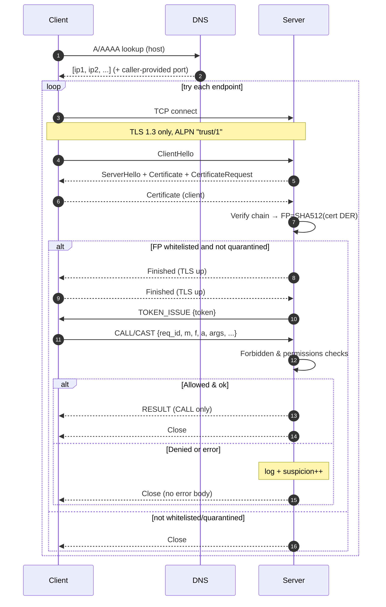
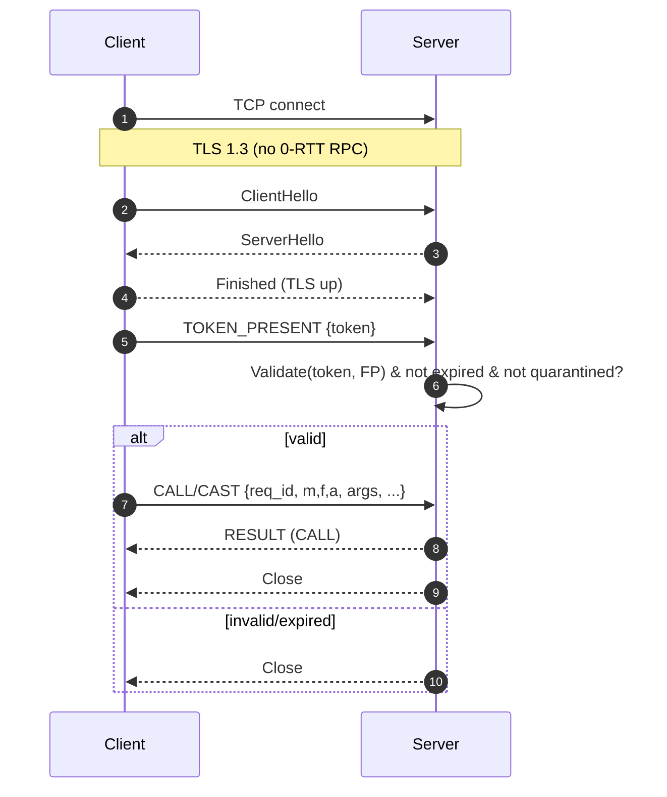
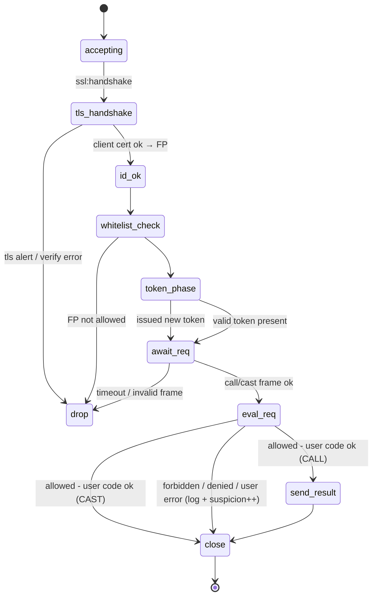
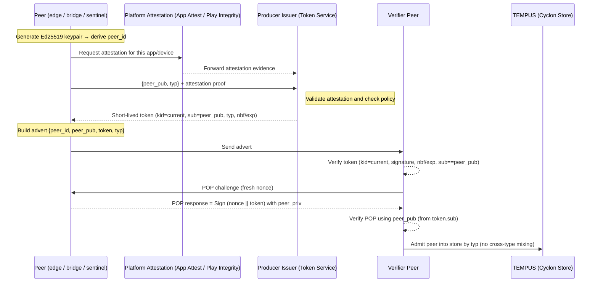

# SEMP


SEMP is a secure communication network overlay for large-scale distributed systems. It uses the distributed Erlang protocol and a custom, DNS-based, **non-EPMD** distribution overlay. Each RPC uses connect→(token path)→call→close. SEMP is comprised two parts: TRUST for stable, long-lived nodes and TEMPUS for ephemeral nodes. 

**TRUST** relies on a node-specific whitelist, connect-reconnect mechanism, and permissions dataset to control communication and defeat intrusions. The TRUST uses mTLS for secure connections and employs a token-based handshake optimization for faster reconnection. TRUST uses a multi-tiered suspicion system to identify and remove untrustworthy nodes, yet allows self-healing and graceful degradation.  

**TEMPUS**, a Cyclon-based network overlay, enables ephemeral node discovery and security, utilizing certificates,and  mTLS for efficient and secure communication.  TEMPUS ensures your dynamic network environment is robust and secure.


Each SEMP RPC call uses a connect→(token path)→call→close behavior to avoid complete graph speed problems. SEMP uses

- TLS 1.3 mTLS with client certs,
- Whitelist via SHA-512 of TBSCertificates,
- Token-accelerated reconnect (short TTL),
- Per-node permissions (modules/functions) + suspicion levels, while
- No errors are sent to clients that malicious actors can leverage.

## Build

Include SEMP as a dependency in your BEAM application and it will be compiled for you. If you want to help develop SEMP, use rebar3 in your pre-system testing builds.

```bash
rebar3 compile
rebar3 shell
```

# TRUST : Trusted, Rapid, Unmodifiable, Secure Topology

**TRUST** (Trusted, Rapid, Unmodifiable, Secure Topology) is a **strict, request-per-connection** overlay for BEAM nodes. It replaces the Erlang distribution handshake entirely, **does not use EPMD**, and requires clients to connect to an explicit **host:port** (DNS A/AAAA only; **no SRV**). Every connection executes at most **one** request (CALL or CAST) and then closes.

TRUST enforces node identity with **TLS 1.3 mutual authentication**, authorizes peers via an on-disk **whitelist** (cert-derived fingerprint → permissions), and accelerates reconnects with **short-lived, server-issued tokens** bound to that fingerprint. All failures are **logged and scored locally** (suspicion/quarantine); errors are **never** sent back to remote peers.

---

## What TRUST does (and does not) do

- ✅ **mTLS identity** (TLS 1.3 only, ALPN `trust/1`); client & server certs required  
- ✅ **Whitelist gate** keyed by **SHA-512(cert DER)**; permissioned MFA execution  
- ✅ **One request per TCP/TLS connection**; orderly close after each request  
- ✅ **Token fast-path**: server issues random, short-lived token per fingerprint (FP); valid token **short-circuits** full post-TLS handshake on reconnect  
- ✅ **Suspicion/quarantine**: adaptive scoring; crossing the limit **revokes token** and refuses further requests until health improves

- ❌ No EPMD, no builtin dist handshake, no node auto-connect  
- ❌ No long-lived channels; no multiplexing; no 0-RTT RPC  
- ❌ No error details returned to the caller (failures are **log-only**)

---

## Identity, whitelist, and permissions

### Identity (mTLS)
- TLS 1.3 only; ALPN advertised/negotiated as `trust/1`
- Server requires client certificate: `{verify, verify_peer}`, `{fail_if_no_peer_cert, true}`
- TRUST derives **FP = SHA-512(client_cert_DER)** and treats this fingerprint as the peer identity

### Whitelist (per overlay; loaded from the **host app’s** `priv/`)
- Source file (example): `priv/trust_whitelist.config` — a **map**  
  `#{ "client-cert.pem" => Spec, ... }`
- On load, TRUST reads PEM from `priv/certs/`, extracts DER, computes **FP**, inserts `{FP, Spec}` into ETS (profile `trust`)
- `Spec` forms:
  - `none`  — nothing permitted (default if omitted/invalid)
  - `any`   — permit any MFA (still subject to the **forbidden** guard)
  - `#{ Module => all | [{Fun, Arity}], ... }` — per-module control

> If a PEM listed in the whitelist is missing, the entry is ignored and a warning is logged.

### Forbidden MFA guard (defense-in-depth)
Before the permissions check, TRUST rejects MFAs that could affect code loading, OS/process control, sockets, tracing, atom creation, OTP behaviors, etc.  
Examples (non-exhaustive):  
- `erlang:list_to_atom/1`, `binary_to_term/1`, `apply/3`, `open_port/2`, process registry ops, timers, tracing, `code:*`, `rpc/erpc`, OTP behaviours entry points, socket stacks (`gen_tcp/udp`, `ssl`, `inets/http*`), any module prefixed `trust_` / `semp_` (and other internal namespaces)

### Permissions gate
After forbidden-check:
- `Spec == any` → allow (minus forbidden set)
- `Spec == #{M => all | [{F,A}]}` → allow listed MFAs for this FP
- otherwise → deny

---

## Tokens (fast reconnects)

- **What**: Random, server-generated bytes `Token` (e.g., 48–64 B) stored **per FP** in ETS with **expiry** (TTL). **One token per FP** (new overwrites old).  
- **When**: After mTLS + whitelist + suspicion pass **and** client has no valid token, server sends `TOKEN_ISSUE` with fresh `Token`.  
- **Use**: Client presents `TOKEN_PRESENT` on the next connection; server validates (constant-time compare + expiry). If valid → proceed directly to request.  
- **Revocation**: If suspicion crosses limit, server deletes `{FP, Token, Exp}` to force the full path next time.  
- **Persistence**: Tokens are in-memory only; a server restart invalidates all tokens (desired).

---

## Framing & wire format

- Transport: **TLS 1.3** stream; no 0-RTT; no compression at TLS/ETF layer  
- Application frames: **length-prefixed ETF** (`<<Len:32/big, Payload/binary>>`)
- Messages (ETF terms are **maps**):
  - `#{t := token_issue,  token := binary()}`  
  - `#{t := token_present, token := binary()}`  
  - `#{t := call, ver := 1, req_id := <<12 bytes>>, m := atom(), f := atom(), a := non_neg_integer(), args := [term()], opts := map()}`
  - `#{t := cast, ver := 1, req_id := <<12 bytes>>, m := atom(), f := atom(), a := non_neg_integer(), args := [term()], opts := map()}`
  - `#{t := result, value := term()}`  (CALL only)

> **Strictness**: The server **requires** the `req_id` shape; missing/ill-typed keys are a protocol error.

---

## Suspicion, quarantine, and self-healing

- Each FP has a **suspicion counter** (or `quarantined`) in ETS
- **Increment on**: protocol violations, forbidden/denied MFAs, user code exceptions, timeouts  
- **Decrement on**: successful permitted requests  
- **Quarantine**: if counter exceeds `suspicion_limit`, set to `quarantined`, **delete token**, refuse further requests until health improves  
- All changes are **logged**; you can also emit events for metrics/alerts

---

## Timeouts, sizes, and limits (defaults; configurable)

- DNS resolve: 2s per NS; total budget ~5s  
- TCP connect: 3s per endpoint; multi-IP with ~250ms stagger  
- TLS handshake: 5s  
- First frame after TLS (token or request): 2s  
- Request execution timeout (`call_timeout_ms`): 5000ms default  
- Max frame: 8 MiB; Max args ETF size: 4 MiB (`payload_too_large`)

---

## Client flow (per request)

1) Resolve host → A/AAAA (caller supplies port)  
2) Connect (iterate IPs)  
3) TLS 1.3 handshake (ALPN `trust/1`)  
4) Token path:
   - If cached valid token for FP → send `TOKEN_PRESENT`
   - Else expect `TOKEN_ISSUE` → cache token
5) (Optional) local pre-filter MFA  
6) Send request:
   - **CALL**: send, then **wait** for `#{t := result, value := Term}`  
   - **CAST**: send and **do not** wait
7) Close TLS

---

## Server flow (per connection)

1) Accept TCP; do TLS 1.3 (ALPN `trust/1`)  
2) Extract client cert DER → **FP = SHA-512(DER)**  
3) **Whitelist**: if FP absent → close; log `whitelist_reject`  
4) **Suspicion**: if quarantined/over limit → delete token; close  
5) **Token short-path**: 
   - If client sends `TOKEN_PRESENT` and token valid → proceed to request  
   - Else issue `TOKEN_ISSUE`, then wait for request
6) Receive request (requires `req_id`)  
   - **Forbidden**? → log; suspicion++; close  
   - **Permissions** deny? → log; suspicion++; close  
   - **Execute** `apply(M,F,Args)` (guarded):
     - Success: **CALL** → send `#{t := result, value := Ret}`; **CAST** → send nothing; suspicion-- (floor at 0); close  
     - Exception: log; suspicion++; maybe quarantine; close silently

---

## Mermaid — full (initial) handshake


## Mermaid — handshake with existing token

## Mermaid — Server FSM (per connection)


## Example TRUST configuration config/sys.config
```code
[
  %% Never auto-connect distributed Erlang
  {kernel, [
    {dist_auto_connect, never},
    {logger_level, info}
  ]},

  %% TRUST overlay (lives under the "trust" app env)
  {trust, [
    {port, 6464},
    {tls_opts, [
      %% Server identity (cert+key) and CA that issued *client* certs
      {certfile,   "priv/certs/localhost+2.pem"},
      {keyfile,    "priv/certs/localhost+2-key.pem"},
      {cacertfile, "priv/certs/ca.pem"}
    ]},

    %% Whitelist file is *always* in the host app's priv/, not the library's
    {whitelist_file, "priv/trust_whitelist.config"},
    {whitelist_default_spec, none},

    %% Execution and policy
    {call_timeout_ms, 5000},
    {suspicion_limit, 3},

    %% Token policy (server-issued random bytes per FP)
    {token_ttl_ms, 300000}   %% 5 minutes, example
  ]}
].
```
## Security notes & pitfalls


- **Enforces strict mTLS.** TLS 1.3 only; `{verify, verify_peer}` and `{fail_if_no_peer_cert, true}`; ALPN must be `<<"trust/1">>`. Does **not** use anonymous ciphers, insecure options, or 0-RTT for RPC. Always sets a trusted client CA via `{cacertfile, ...}` or `{cacerts, ...}`.

- **Unique certificate per node.** Each non-standalone node must have its own client cert. Sharing a cert collapses identity and breaks suspicion/quarantine accuracy. Track whitelist entries by **cert DER → SHA-512 fingerprint** generated at load time from PEMs in `priv/certs/`.

- **Tokens are not identity.** Tokens are server-issued random bytes, per-fingerprint, short-lived, stored in-memory, compared in constant time, and **revoked on quarantine**. They only fast-path reconnects and are intentionally invalidated on server restart.

- **Strict framing and sizes.** All app frames are length-prefixed ETF. Cap maximum frame/payload (e.g., 8 MiB frame, 4 MiB args). Reject oversize inputs with a protocol error (log-only).

- **Defense-in-depth forbidden set.** Proactively rejects dangerous MFAs (code loading, tracing, OS/ports, sockets/HTTP stacks, atom creation, OTP behaviour entry points, process introspection, timers, your internal namespaces like `trust_*` / `semp_*`, etc.) before permission evaluation.

- **Does not leak errors to clients.** The wire protocol only returns `#{t := result, value := Term}` for successful CALLs. CAST never returns anything. All failures are logged locally and contribute to suspicion.

- **Whitelist is authoritative.** `any` is allowed but weaker—prefer explicit per-module function allowlists. Missing PEMs in the whitelist are ignored (with warnings). Keep `priv/trust_whitelist.config` under the **host app’s** `priv/`.

- **Suspicion/quarantine tuning.** Increments on protocol violations, forbidden/denied MFAs, timeouts, user code errors. Decrements on successful permitted requests. Exceeding the limit sets `quarantined` and deletes the token and quarenteens the requester. Quarenteened peers require an out-of-system reset.

- **Operational hardening.** Use per-connection timeouts, accept backoff on errors, and consider connection rate limiting. Ensure ETS tables are created with read/write concurrency flags and appropriate privacy (whitelist read-only to normal processes).

- **Name resolution.** Only A/AAAA; no SRV. Be mindful of local resolver configuration and caching; optionally pin or bound TTLs in callers.

---

## Typical failure modes (and responses)

- **Whitelist miss (FP not present)**  
  *Server action:* Close TLS; log `whitelist_reject`. No response body.  
  *Client result:* `{error, connect_failed}` or `{error, closed}` after handshake.

- **Quarantined / suspicion exceeded**  
  *Server action:* Delete token for FP; refuse request; close. Logged with reason.  
  *Client result:* `{error, closed}`; subsequent reconnects require fresh full path.

- **Token invalid/expired/mismatched**  
  *Server action:* Close; do not fall back in the same connection.  
  *Client result:* Must reconnect; receives `TOKEN_ISSUE` on full path.

- **Protocol violation (bad ETF / wrong shape / missing keys / size limit)**  
  *Server action:* Log `protocol_error`; suspicion++; close.  
  *Client result:* `{error, closed}` or `{error, protocol_error}` (if detectable client-side).

- **Forbidden MFA**  
  *Server action:* Log `forbidden_mfa`; suspicion++; close (no body).  
  *Client result:* `{error, closed}`.

- **Permissions deny**  
  *Server action:* Log `permission_denied`; suspicion++; close (no body).  
  *Client result:* `{error, closed}`.

- **User code exception during apply/3**  
  *Server action:* Log `user_code_error`; suspicion++; close (no body).  
  *Client result:* `{error, closed}`.

- **Timeouts**  
  *Handshake/first-frame/request timeout*  
  *Server action:* Log with stage (`tls_timeout` / `first_frame_timeout` / `call_timeout`); suspicion++ (soft); close.  
  *Client result:* `{error, timeout}` or `{error, closed}`.

- **ALPN mismatch**  
  *Server action:* Close; log `alpn_mismatch`.  
  *Client result:* `{error, closed}` from TLS.

- **TLS verify failure / missing client cert / expired cert**  
  *Server action:* TLS alert; connection terminated; log `tls_verify_failed`.  
  *Client result:* `{error, tls_alert}` or `{error, closed}` depending on side.

- **DNS/connectivity (NXDOMAIN, refused, connect timeout)**  
  *Client action:* Iterates endpoints; on exhaustion returns `{error, connect_failed}`. Server sees nothing.

- **Server restart**  
  *Effect:* All in-memory tokens become invalid; next client attempt fails token validation and is forced through the full path (with new `TOKEN_ISSUE`).


# TEMPUS : Transient Entities Managed by a Peer-overlay for Unified Security


TEMPUS is a secure peer–sampling and membership layer that uses the **Cyclon** gossip protocol to keep three **independent** peer sets fresh and unbiased—**within a single process**. Each peer set (“type”) has its own Cyclon view, capacity, and shuffle cadence. There is **no cross-type shuffle**.

The goal: a highly and robustly secure system where peers are cryptographically verifiable, churn is handled gracefully, and sampling remains uniform **within** each population.

---

## Peer Types (three isolated Cyclon views)

We track three populations side-by-side:

- **Type 1 — `tempus_edge` (ephemeral)**  
  High-churn, short-lived peers (formerly called `tempus`). These form the bulk of the mesh and do standard Cyclon shuffles among themselves.

- **Type 2 — `tempus_bridge` (non-ephemeral)**  
  Longer-lived peers that **bridge** to separate **TRUST** overlays/instances. They shuffle **only** with other `tempus_bridge` peers. Application logic uses them to reach TRUST—Cyclon state stays isolated.

- **Type 3 — `tempus_sentinel` (non-ephemeral; membership guardians)**  
  Longer-lived peers that ephemeral nodes use to **prove producer-authorized membership**. They run Cyclon among themselves for availability, and act as admission guardians (see “Identity & Admission”).

> You may run different counts of each type. The only invariant is **no cross-type mixing**.

---

## How Cyclon is used in TEMPUS

- One TEMPUS server maintains **three independent Cyclon stores**:  
  `tempus_edge`, `tempus_bridge`, `tempus_sentinel`.
- Each store has: fixed **capacity**, shuffle size **l**, independent **tick** (periodic timer), and maintains `(peer, age)` entries.
- **Within a store** on each tick:
  1. Increment ages.
  2. Pick the **oldest** neighbor as the shuffle partner.
  3. Prepare an outgoing buffer (include `{self, age=0}`), remove sent entries from the local view.
  4. On merge, prefer **younger** entries; **evict oldest** to respect capacity.
- **Across stores**: there is **no exchange** of entries; each population remains unbiased relative to itself.

---

## Identity & Admission (security model)

TEMPUS separates **sampling** (Cyclon) from **trust** (admission). A peer only enters a store after proving it’s an authorized instance of your product—**without any shared secret** among peers.

**Core elements:**

1) **Per-install asymmetric identity**  
Each node generates an **Ed25519** keypair on first run and derives a `peer_id` from the public key. No symmetric keys are shared between peers.

2) **Producer-signed, short-lived tokens**  
Your backend (“producer”) issues **very short-lived** tokens (e.g., 2–5 minutes) that bind to the peer’s public key (`sub`) and include role/type (`typ ∈ {tempus_edge, tempus_bridge, tempus_sentinel}`).

3) **No-overlap key rotation (strict)**  
Verifiers pin to the **current** signing key via `kid` (key id). At rotation, tokens signed with an old key are **rejected** with a precise “rotated key” error; legitimate peers immediately re-fetch a token under the new key. Tight TTLs + proactive refresh (`TTL/2`) keep recovery fast.

4) **Proof-of-Possession (POP)**  
When presenting a token, the peer signs a fresh challenge with its **own** private key (the same public key carried in `sub`). Replay of copied tokens fails without the private key.

5) **Platform attestation for app-store builds**  
On iOS use **App Attest** (and on Android **Play Integrity**) during token issuance so your backend only signs tokens for genuine, unmodified builds on real devices.

**Outcome:** Only peers with **valid, current** producer signatures **and** POP are admitted to the appropriate Cyclon store. Bad actors without both are excluded.

---

## Sequence (high level)


