# TRUST System Design - Mermaid Diagrams

This document contains Mermaid diagrams that represent the supervisor hierarchy, component relationships, and data flow through the TRUST (Trusted Remote Unified Secure Transport) system.

## Table of Contents

1. [Supervisor Hierarchy](#supervisor-hierarchy)
2. [Component Relationships](#component-relationships)
3. [Connection Lifecycle](#connection-lifecycle)
4. [Data Flow Diagrams](#data-flow-diagrams)
5. [FSM State Transitions](#fsm-state-transitions)
6. [RPC Request Processing](#rpc-request-processing)

---

## Supervisor Hierarchy

### Complete Supervision Tree

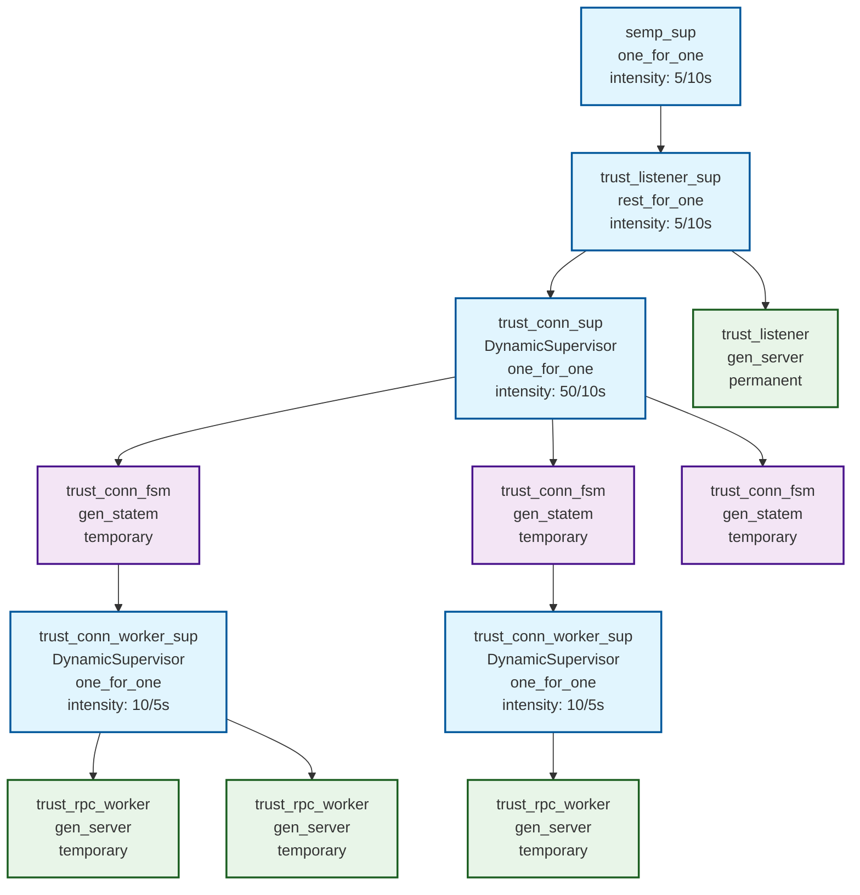

### Supervisor Strategies and Restart Policies

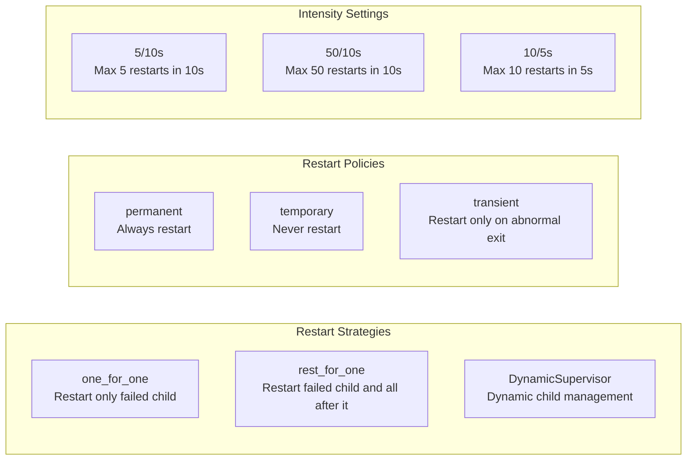

---

## Component Relationships

### Core Components and Dependencies

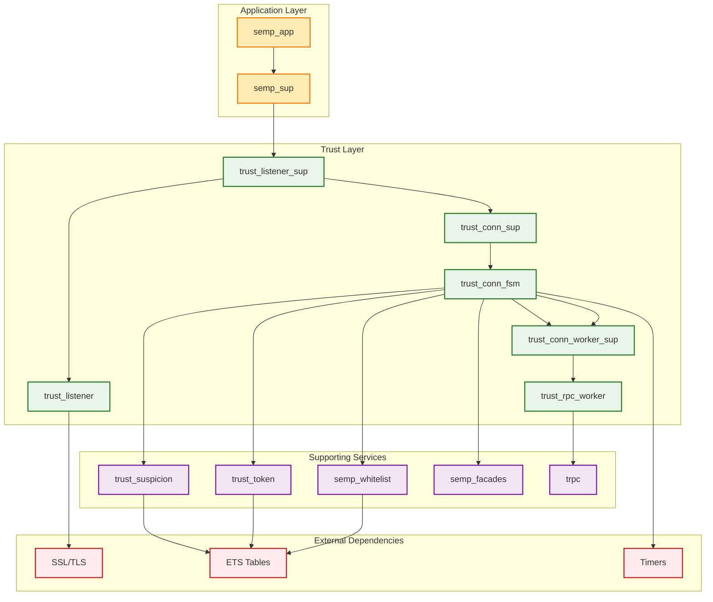

### Process Communication Patterns

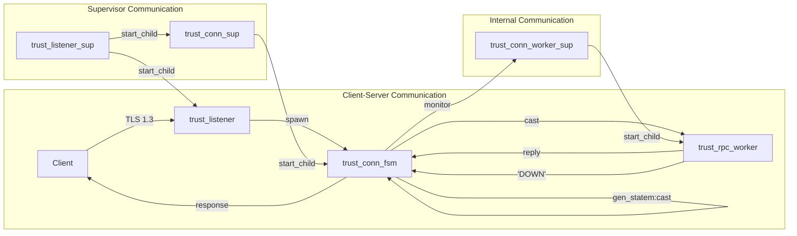

---

## Connection Lifecycle

### TLS Connection Establishment

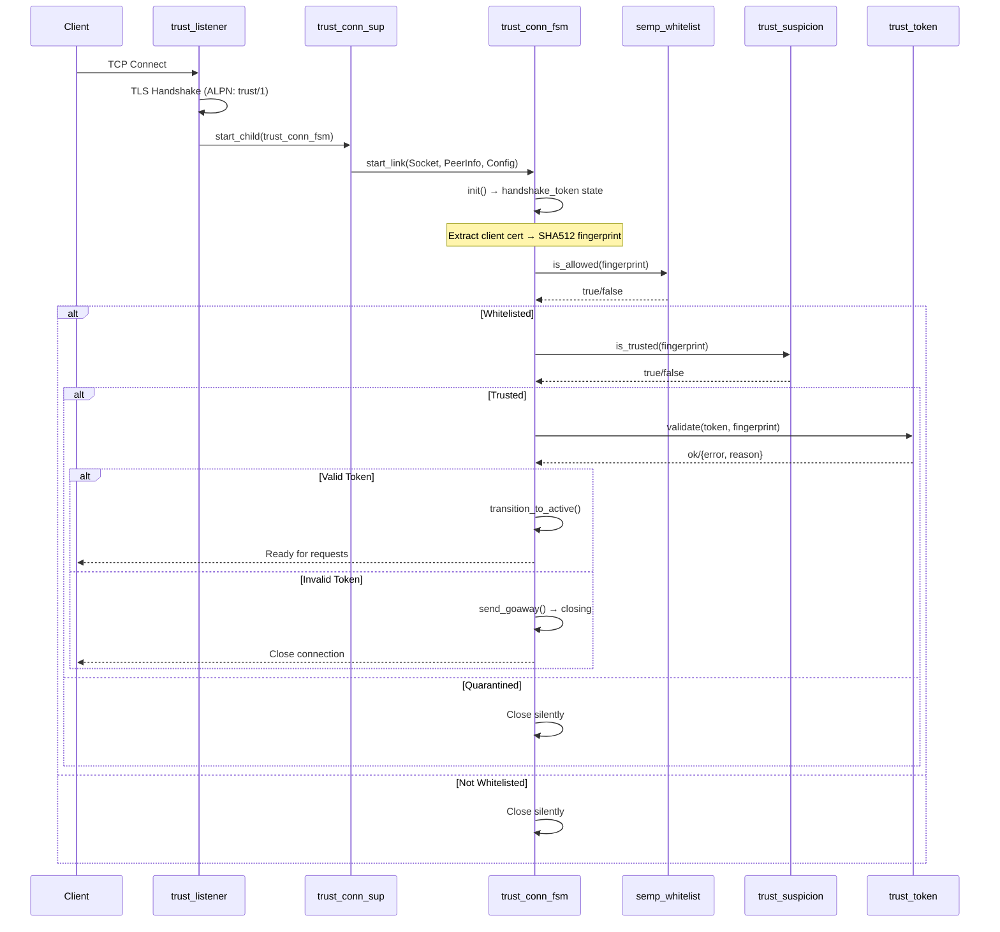

### Connection Termination

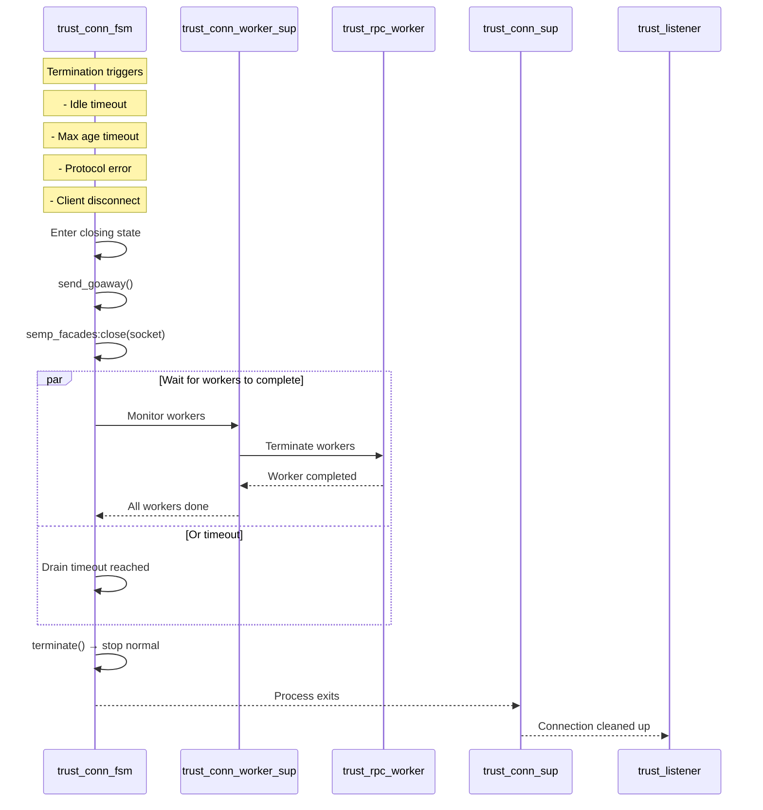

---

## Data Flow Diagrams

### Request Processing Flow

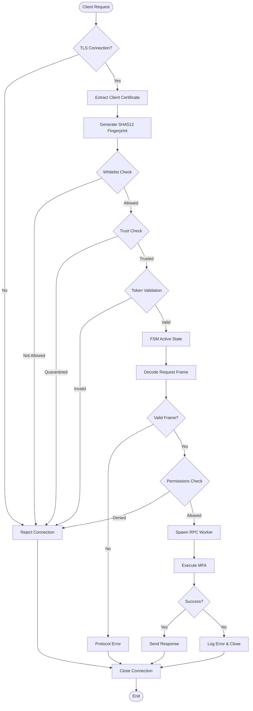

### Multiplexed Request Handling

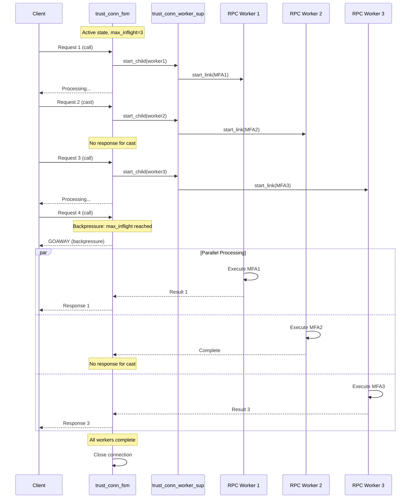

---

## FSM State Transitions

### Connection FSM State Machine

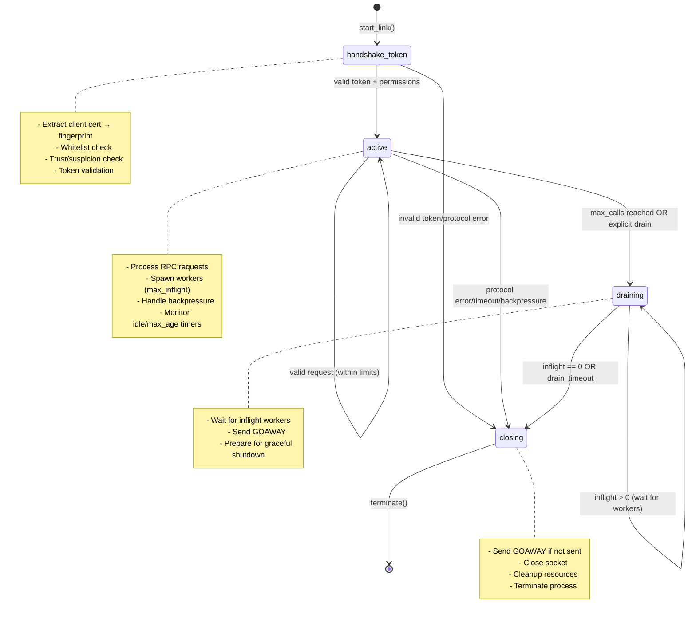

### FSM Event Handling

```mermaid
graph TD
    subgraph "Event Types"
        E1[cast: {ssl, Socket, Bin}]
        E2[info: idle_timeout]
        E3[info: max_age_timeout]
        E4[info: {'DOWN', Pid, Reason}]
        E5[enter: state_name]
    end
    
    subgraph "State Handlers"
        H1[handle_handshake_token/3]
        H2[handle_active_request/3]
        H3[handle_draining_wait/3]
        H4[handle_closing_cleanup/3]
    end
    
    subgraph "Actions"
        A1[spawn_worker/2]
        A2[send_goaway/3]
        A3[semp_facades:close/1]
        A4[reset_idle_timer/1]
        A5[trust_suspicion:bump/2]
    end
    
    E1 --> H1
    E1 --> H2
    E2 --> H1
    E2 --> H2
    E3 --> H1
    E3 --> H2
    E4 --> H2
    E5 --> H4
    
    H1 --> A1
    H1 --> A2
    H1 --> A3
    H1 --> A4
    H2 --> A1
    H2 --> A2
    H2 --> A3
    H2 --> A4
    H2 --> A5
    H3 --> A2
    H3 --> A3
    H4 --> A3
```

---

## RPC Request Processing

### Worker Lifecycle

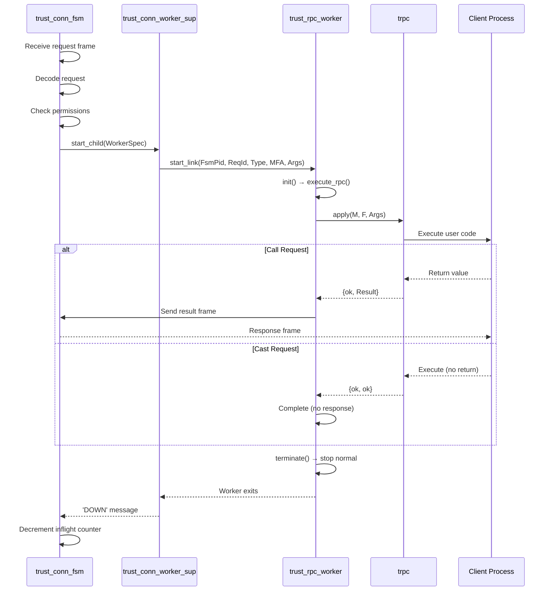

### Error Handling and Recovery

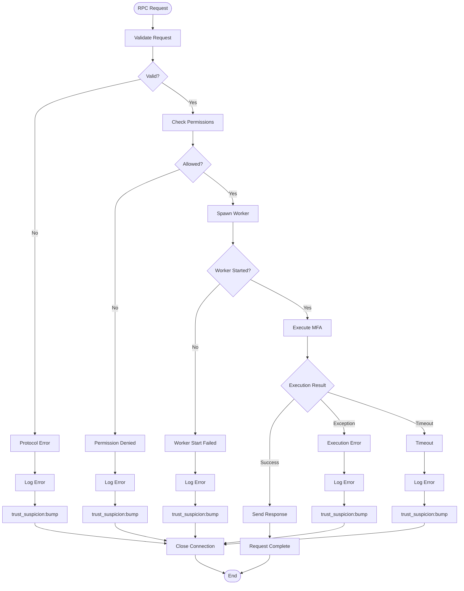

---

## System Architecture Overview

### High-Level System View

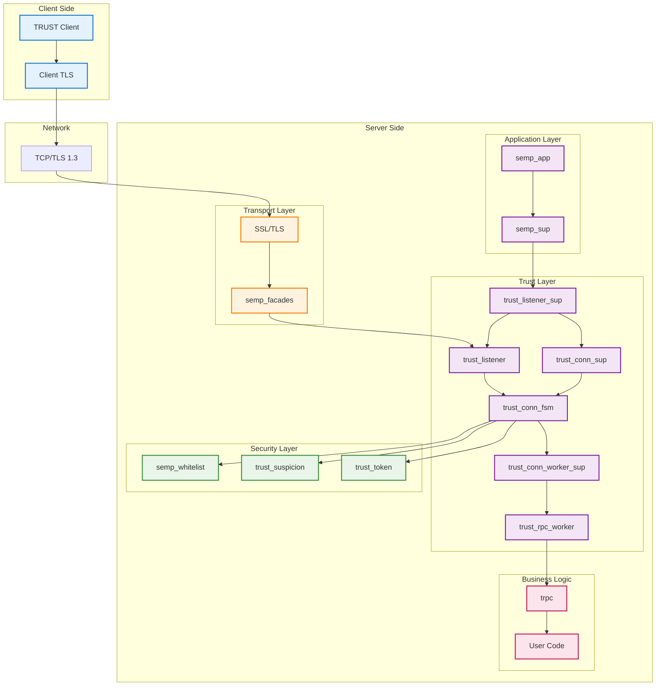

This comprehensive design document provides a complete view of the TRUST system architecture, showing how supervisors manage processes, how data flows through the system, and how the various components interact to provide secure, multiplexed RPC communication.
