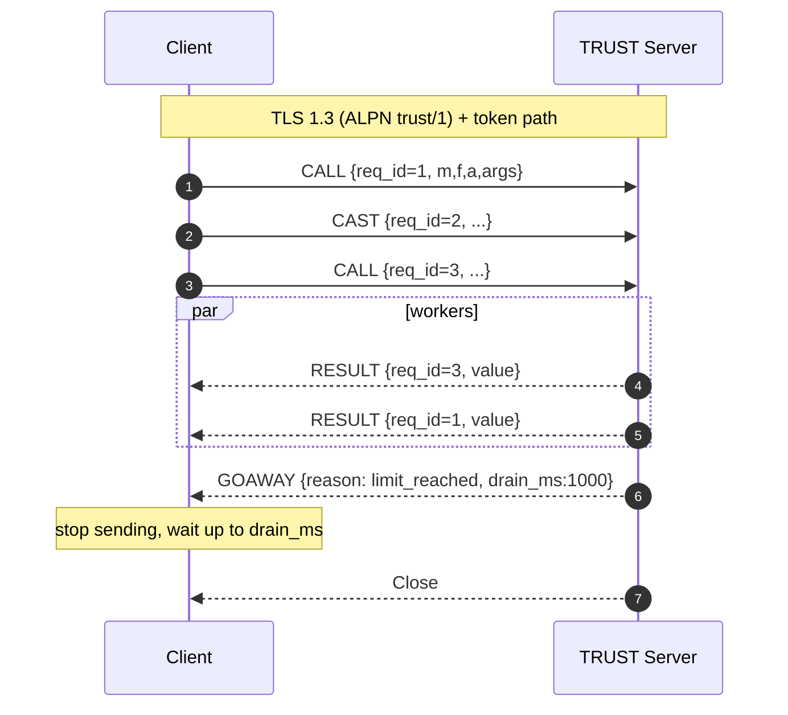
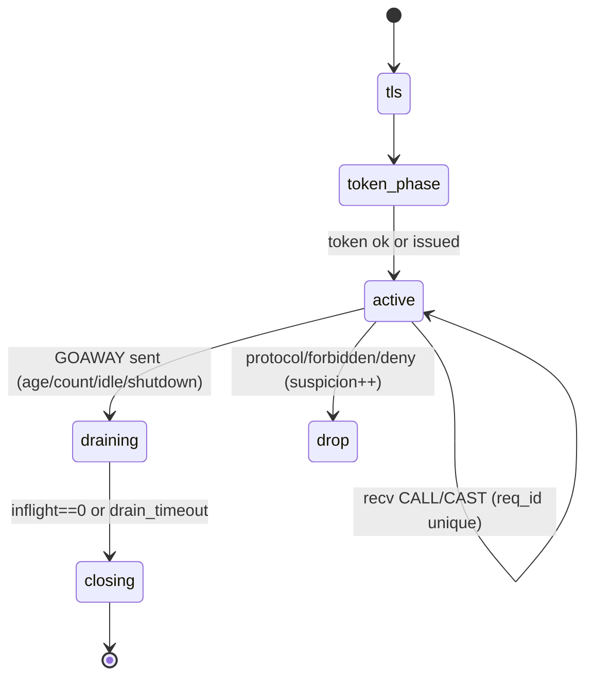
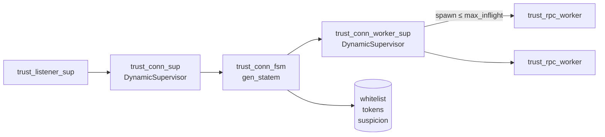
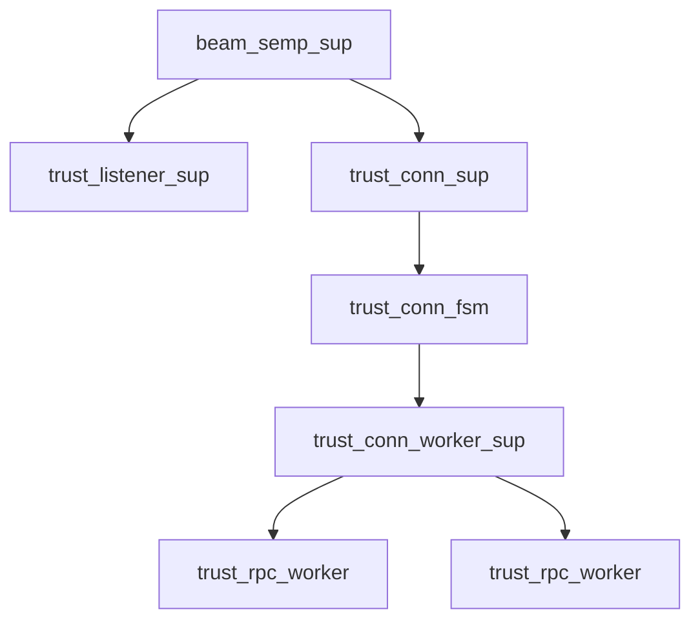

# Overview & Scope

- **Working Title:** *TRUST Windowed Multiplexing*
- **Problem Statement:** Current TRUST overlay permits **one RPC per TLS connection**, creating CPU/RTT overhead. We must add **time- and number-limited multiplexing** while preserving TRUST’s strict security model (mTLS, whitelist, forbidden MFAs, no error leakage).
- **Objectives / Success Metrics:**
  - Reduce median RPC latency under burst by eliminating repeated handshakes
  - Cap per-connection resource use with **session windows** (age + count + inflight)
  - Maintain security invariants and backward compatibility
- **In Scope:** TRUST server & client protocol, connection FSM, policy/limits, metrics.
- **Out of Scope:** TEMPUS overlay changes; long-lived unlimited streams; 0‑RTT; HTTP/2.
- **Primary Users / Personas:** BEAM services using TRUST for RPC (operators & service authors).

# Requirements & Assumptions

**Traceable IDs:** R-1..R-9

- **Functional Requirements:**
  - **R-1:** Support multiple CALL/CASTs per TLS connection within a **session window**.
  - **R-2:** Session window ends on first of: **max\_age\_ms**, **max\_calls**, **idle\_ms**; then server sends **GOAWAY** and closes gracefully.
  - **R-3:** Limit concurrent work with **max\_inflight** per connection (backpressure via TCP + reads paused).
  - **R-4:** Responses are correlated by existing ``; order is not guaranteed.
  - **R-5:** Preserve security: mTLS, whitelist, forbidden MFAs, **no error frames** to client.
  - **R-6:** Backward compatible with one‑RPC behavior (limits set to 1 → identical semantics).
  - **R-7:** Per‑fingerprint suspicion/quarantine logic remains authoritative.
  - **R-8:** Emit metrics: session\_age, calls\_total, inflight\_peak, closes\_by\_reason.
  - **R-9:** Configuration via `beam_semp` application env (`session` map includes `max_inflight`, `max_age_ms`, `idle_ms`, `max_calls`, ``). **Code default = 1000 ms**, overridable via `sys.config`; validated on boot.

| ID  | Requirement                            | Priority | Source | Status |
| --- | -------------------------------------- | -------- | ------ | ------ |
| R-1 | Multiplexed session window             | Must     | Team   | Draft  |
| R-2 | Window end by age/count/idle           | Must     | Team   | Draft  |
| R-3 | Per-conn max\_inflight                 | Must     | Team   | Draft  |
| R-4 | Response correlation by req\_id        | Must     | Team   | Draft  |
| R-5 | Preserve security model                | Must     | Team   | Draft  |
| R-6 | Backward compatibility                 | Must     | Team   | Draft  |
| R-7 | Suspicion/quarantine unchanged         | Must     | Team   | Draft  |
| R-8 | Metrics                                | Should   | Ops    | Draft  |
| R-9 | Config via beam\_semp env & sys.config | Must     | Ops    | Draft  |

# Architecture & Rationale

- **Architectural Style:** Windowed, short‑lived multiplexed sessions over TLS; **per‑connection **``** (handle\_event mode)** managing session limits and backpressure.
- **Key Components:**
  - `trust_listener_sup` → acceptor pool handing off accepted TLS sockets.
  - `trust_conn_sup` (DynamicSupervisor) → starts one `` per accepted socket.
  - `trust_conn_fsm` (gen\_statem states: `handshake_token → active → draining → closing`) → owns socket, window counters/timers, inflight tracking, pauses/resumes reads, emits GOAWAY.
  - `` (per‑connection DynamicSupervisor) → owns **temporary** `trust_rpc_worker` children (≤ `max_inflight`).
- **Data Model (high-level):** ETF frames + control frame `GOAWAY #{reason, drain_ms}`; responses correlated via existing `req_id`.
- **External Integrations:** unchanged (mTLS, whitelist, token issuance/validation).
- **Technology Choices & Rationale:** Per‑connection worker supervisor gives uniform lifecycle, crash isolation, and clean shutdown in `draining/closing` while keeping the FSM minimal. Children are `temporary`; no restarts after completion.
- **Configuration & Defaults:**
  - Defaults in `beam_.app.src` under `{env, [...]}` with `session` map.
  - **Default **``** = 8** (can be overridden in `sys.config`).
  - `sys.config` precedence: runtime overrides app file defaults at boot.
- **Risk Areas & Mitigations:**
  - Unbounded concurrency → **cap **``, pause reads when full, resume on worker `DOWN`.
  - Session leak → hard `` and `drain_timeout`; terminate in `closing`.
  - Memory under paused reads → per‑frame size cap & queued‑bytes limit per connection.

# Mermaid Diagrams









# FSM Transition Tables

### Connection FSM (`trust_conn_fsm`, handle\_event mode)

*Assumptions:* ETF frames; per-connection limits `{max_inflight, max_age_ms, idle_ms, max_calls}`; timers use `state_timeout`; workers are temporary children under `trust_conn_worker_sup`.

| State             | Event                                        | Guard/Condition                                           | Actions (effects)                                                                                                                               | Next       | Timer      |
| ----------------- | -------------------------------------------- | --------------------------------------------------------- | ----------------------------------------------------------------------------------------------------------------------------------------------- | ---------- | ---------- |
| `handshake_token` | `info:{ssl, Sock, Bin}` (TOKEN/HELLO)        | TLS ok ∧ whitelist ok ∧ token ok                          | send `OK`; set `{state_timeout, idle_ms, idle}`; start one-shot **max\_age** timer via `erlang:send_after`; `ssl:setopts(Sock,[{active,once}])` | `active`   | idle       |
| `handshake_token` | `info:{ssl,_,_}`                             | token invalid ∨ forbidden MFA                             | send `GOAWAY#{reason:=deny,drain_ms:=0}`; `ssl:close(Sock)`                                                                                     | `closing`  | —          |
| `handshake_token` | `info:{ssl_error/ssl_closed}`                | —                                                         | close socket; log suspicion++                                                                                                                   | `closing`  | —          |
| `active`          | `info:{ssl, Sock, Bin}` (CALL/CAST) → decode | `inflight < max_inflight`                                 | spawn monitored `trust_rpc_worker`; `inflight++`; `calls_total++`; reset idle (`state_timeout=idle_ms`); keep `{active,once}`                    | `active`   | idle       |
| `active`          | `info:{ssl, _, _}` (CALL/CAST)               | `inflight >= max_inflight`                                | **pause reads** `ssl:setopts(Sock,[{active,false}])`; **do not decode or queue**; rely on TCP/TLS backpressure                                  | `active`   | idle       |
| `active`          | `internal:limit_reached`                     | `calls_total>=max_calls ∨ max_age_expired ∨ idle_expired` | send `GOAWAY#{reason:=limit_reached,drain_ms:=Drain}`; set `state_timeout=Drain` (tag `drain`); stop accepting new requests                     | `draining` | drain      |
| `active`          | `info:'DOWN'(Pid,_,process,Pid,Reason)`      | worker finished                                           | `inflight--`; if paused and `inflight < max_inflight` → `ssl:setopts(Sock,[{active,once}])`                                                     | `active`   | reset idle |
| `active`          | `info:{ssl_closed/ssl_error}`                | —                                                         | close socket                                                                                                                                    | `closing`  | —          |
| `draining`        | `info:{ssl, _, _}` (new CALL/CAST)           | —                                                         | ignore/log; (optionally count as refused)                                                                                                       | `draining` | —          |
| `draining`        | `info:'DOWN'` & `inflight==0`                | —                                                         | `ssl:close(Sock)`                                                                                                                               | `closing`  | —          |
| `draining`        | `state_timeout` (drain)                      | —                                                         | `ssl:close(Sock)`                                                                                                                               | `closing`  | —          |
| `closing`         | any                                          | —                                                         | terminate `{stop,normal}`; cancel timers; demonitor residual                                                                                    | —          | —          |

**Notes**

- **Max-age:** set once on entry to `active` (self-message toggles `max_age_expired=true` → raises `internal:limit_reached`).
- **Idle:** every handled event in `active` resets `state_timeout(idle)`.
- **Backpressure:** when `inflight==max_inflight`, keep socket inactive; on `'DOWN'`, resume with `{active,once}`.
- **Metrics:** increment `calls_total`, `closes_by_reason`, `inflight_peak`; tag with client fingerprint.

# Process Tree & Specs

### Supervision Overview

- **Root:** `beam_semp_sup` (one\_for\_one; intensity **5/10s**)
  - `trust_listener_sup` (acceptor pool)
  - `trust_conn_sup` (**DynamicSupervisor**, one\_for\_one; intensity **50/10s**)

### Per-connection

- `trust_conn_sup` starts `` (one per TLS socket). The FSM then starts (and links) a **per-connection **`` (DynamicSupervisor) to own RPC workers. When the FSM transitions to `closing` and exits **normal**, the linked worker supervisor also terminates.

### Child Specs

**Connection FSM (**``**)** — child of `trust_conn_sup`

```erlang
#{ id => trust_conn_fsm,
   start => {trust_conn_fsm, start_link, [Socket, PeerInfo, Opts]},
   restart => temporary,        %% session closes normally; do not restart
   shutdown => 5000,            %% allow clean GOAWAY/drain
   type => worker,
   modules => [trust_conn_fsm] }.
```

**Per-connection Worker Supervisor (**``**)** — started (linked) by FSM

```erlang
%% in trust_conn_worker_sup:init/1
{ok, {#{ strategy => one_for_one,
         intensity => 10,      %% max restarts
         period => 5 },        %% within seconds
       []}}.
```

**RPC Worker (**``**)** — child of `trust_conn_worker_sup`

```erlang
RpcSpec(ReqId, Req, ConnCtx) ->
  #{ id => {trust_rpc_worker, ReqId},
     start => {trust_rpc_worker, start_link, [Req, ConnCtx]},
     restart => temporary,     %% completes or crashes; never restart
     shutdown => 4000,         %% give M/F/A call a moment to finish
     type => worker,
     modules => [trust_rpc_worker] }.
```

### Start/Stop Semantics

- **Start order:** FSM starts, validates token → on `active`, it starts `trust_conn_worker_sup` (if not already).
- **Stop order:** FSM enters `draining` → waits for `inflight==0` **or** drain timeout → enters `closing` and exits **normal**; the linked `trust_conn_worker_sup` stops; any remaining workers are terminated by their supervisor.
- **Crash behavior:** If `trust_conn_worker_sup` crashes, the link causes the FSM to receive `'EXIT'` and move to `closing` (socket closed). `trust_conn_sup` does **not** restart the FSM (`restart=temporary`).
- **Client cancel (v1):** `{ssl_closed, Sock}` in `active|draining` ⇒ treat as **CANCEL-by-close**; terminate `trust_conn_worker_sup` with reason `client_cancel`; kill in-flight workers immediately; emit metrics; no suspicion increment.
- **Server shutdown:** Send `GOAWAY#{reason:=shutdown, drain_ms:=Drain}`; enter `draining`; close when `inflight==0` or `drain_timeout`.

# System Configurations
The following **runtime defaults** can be placed in `sys.config` to configure multiplexed sessions. These override `beam_semp.app.src` values at boot.

```erlang
[
  {beam_trust, [
    {session, #{
        max_inflight => 8,       %% default concurrency per connection
        max_age_ms   => 60000,   %% hard session age cap
        idle_ms      => 5000,    %% idle timeout before draining
        max_calls    => 100,     %% max calls per session window
        drain_ms     => 1000     %% GOAWAY drain; capped by idle_ms
    }}
  ]}
].
```

# GOAWAY Semantics & Post-GOAWAY Policy
- **Reasons (ver=1):** `limit_reached | shutdown | deny | protocol`.
- **Sender closes:** the node that sends GOAWAY calls `ssl:close/1` (drain for the first two; immediate for the last two).
- **Drain:** `effective_drain_ms = min(drain_ms (or code default 1000 ms), idle_ms)`.
- **After GOAWAY:** new CALL/CAST are ignored/refused; increment `requests_refused_total`; no decoding while paused.
- **Suspicion:** increment on `{deny,protocol}` only; not on `{limit_reached,shutdown}`.
- **Compatibility:** with single-call config, GOAWAY is never sent.

# Protocol & Behavior

## Client Contract
- **Uniqueness:** Client supplies a **per-client request tag** `req_id` (e.g., small non-negative integer). It MUST be unique **among that client’s in-flight requests**; it need **not** be globally unique. The server derives `client_id` from authenticated keys and correlates by `{client_id, req_id}`. Duplicates on the same connection are ignored and counted in `duplicates_total`.
- **GOAWAY handling:**
  - On `goaway#{reason:=limit_reached|shutdown, drain_ms:=D}` → **stop sending immediately**, open a **new connection** for further RPCs, and optionally wait up to `D` ms for in-flight results on the old connection.
  - On `goaway#{reason:=deny|protocol}` → **stop sending and drop the connection**; do not retry until the cause is fixed.
- **Retries & backoff:** Reconnect with **exponential backoff + jitter** (base 100–500 ms, cap 5 s) on transport errors or `limit_reached|shutdown`.
- **Versioning:** All frames include `ver=1`. Unknown top-level keys are ignored; unknown `t` results in `goaway#{reason:=protocol}`.

## Deadlines & Cancellation
- **Deadlines:** If a request includes `deadline_ms`, the server enforces **admission-time** checks (reject if expired). In-flight expiry is **logged** and allowed to complete (no worker preemption in v1).
- **Cancellation (v1):** **CANCEL-by-close.** When the client closes the socket in `active | draining`, the server treats it as cancelling the entire session:
  - FSM handles `{ssl_closed, Sock}` → terminates `trust_conn_worker_sup` with reason `client_cancel`, immediately stopping all in-flight workers (**kill_workers** policy).
  - No suspicion increment; emit metrics `client_cancels_total` and `inflight_at_cancel`.
  - Client reconnects for new work; **no explicit CANCEL control frame** exists in v1.
- **Per-request CANCEL (v1.1 option):** only in `draining`; verify same `client_id`, preempt worker with `exit(Pid, shutdown)`, suppress RESULT, optionally reply `cancel_ok`.

## Duplicate / Unknown Handling
- **Duplicate `{client_id, req_id}`:** drop silently; increment `duplicates_total`.
- **Unknown `reason` in GOAWAY:** treat as `protocol` and close immediately.

## Bounds (proposed defaults)
- `frame_size_max = 1 MiB`, `args_len_max = 64 KiB` (admission-time checks). Oversize ⇒ protocol close.

# Config Validation & Bounds

**Source & Precedence**
- Code defaults embedded in server modules → overridden by `beam_semp` **app env** → overridden by `sys.config` at boot.
- v1: no live reload; changes apply on restart. New connections inherit the booted config.

## Session Map Keys (validated at boot)
| Key           | Type              | Default | Bounds / Rules                                      |
|---------------|-------------------|--------:|-----------------------------------------------------|
| `max_inflight`| pos_integer()     | **8**   | 1..64                                               |
| `idle_ms`     | non_neg_integer() | **5000**| 100..600_000; must satisfy `idle_ms =< max_age_ms`  |
| `max_age_ms`  | pos_integer()     | **60000**| 1_000..3_600_000                                   |
| `max_calls`   | pos_integer()     | **100** | 1..100_000 per session window                       |
| `drain_ms`    | non_neg_integer() | **1000** (code default) | 0..60_000; **Effective = min(drain_ms, idle_ms)** |

## Framing & Payload Bounds
| Key              | Type                  | Default        | Bounds / Rules                                  |
|------------------|-----------------------|---------------:|-------------------------------------------------|
| `frame_size_max` | pos_integer() (bytes) | **1_048_576**  | 65_536..8_388_608; oversize ⇒ protocol close    |
| `args_len_max`   | pos_integer() (bytes) | **65_536**     | 0..`frame_size_max`; pre-decode check           |

## Optional Listener/Global Controls (v1)
| Key                | Type          | Default                          | Notes                                   |
|--------------------|---------------|----------------------------------|-----------------------------------------|
| `acceptors`        | pos_integer() | `2 * schedulers_online()`        | Pool of `ssl:transport_accept/1`        |
| `session_slots_max`| pos_integer() | _unset_                           | If set, acts as a global admission gate |

## Validation Algorithm (boot)
1. Read `beam_semp` env and `sys.config`; merge onto code defaults.
2. Validate against bounds and cross-field rules (`idle_ms =< max_age_ms`).
3. **Fail-fast policy:** any invalid value → **abort boot** with a clear error; no clamping.
4. Log a sanitized **config summary** on success.

> Existing connections are governed by the config at their creation time.

# Observability (Metrics & Logging)
**Tools:** Use OTP **`logger`** for structured logs and **`telemetry`** for events. Metrics are derived by a telemetry backend (e.g., Prometheus exporter).

## Telemetry Events
- `[:trust, :session, :start]` — meta: `#{client_id, peer_ip, sni}`
- `[:trust, :session, :end]` — meas: `#{age_ms}`; meta: `#{reason}`
- `[:trust, :goaway]` — meta: `#{reason, drain_ms}`
- `[:trust, :request, :accept]` — meta: `#{type := call|cast, req_id}`
- `[:trust, :request, :refuse]` — meta: `#{reason := max_inflight|draining|goaway|duplicate|malformed}`
- `[:trust, :request, :finish]` — meas: `#{duration_ms}`; meta: `#{req_id, outcome := ok|error}`
- `[:trust, :pause]` / `[:trust, :resume]`
- `[:trust, :worker, :crash]` — meta: `#{req_id, class := exit|throw|error, reason}`

## Metrics
**Counters:**  
`trust_sessions_started_total{tls_ver,alpn}` • `trust_sessions_ended_total{reason}` • `trust_goaway_total{reason}` • `trust_requests_total{type,outcome}` • `trust_requests_refused_total{reason}` • `trust_duplicates_total{}` • `trust_client_cancels_total{}` • `trust_worker_crashes_total{class}` • `trust_protocol_close_total{code}` • `trust_resume_reads_total{}`

**Gauges:**  
`trust_sessions_active` • `trust_inflight_requests{conn}`

**Histograms:**  
`trust_session_age_ms` • `trust_result_latency_ms` • `trust_paused_duration_ms`

## Structured Logging (via `logger`)
Core fields: `ts, level, event, client_id, peer_ip, sni, conn_id, state, inflight, max_inflight, session_age_ms`.

Examples:
```json
{"event":"request.accept","client_id":"fp:ab12","conn_id":"c-42","req_id":7,"type":"call","m":"mod","f":"fun","a":2,"inflight":3}
```
```json
{"event":"goaway","reason":"limit_reached","drain_ms":1000,"conn_id":"c-42","inflight":3,"session_age_ms":59871}
```
```json
{"event":"session.end","reason":"shutdown","conn_id":"c-42","age_ms":60123}
```
## Alerting & SLO Hints
- SLO: `trust_result_latency_ms` p95 target; alert on p99 sustained breaches.
- Protocol issues: alert on `trust_protocol_close_total` spikes.
- Backpressure stress: alert on `trust_requests_refused_total{reason="max_inflight"}` or `trust_paused_duration_ms` growth.
- Security posture: alert on `{reason="deny"|"protocol"}` growth in `trust_sessions_ended_total`.
- Stability: alert on `trust_worker_crashes_total` rate > baseline.

## Sampling & Privacy
- Rate-limit high-volume request logs; always log session start/end and GOAWAY.
- Never log full args; log `m/f/a` only; redact tokens; cap string sizes.

# Security Threat Model (STRIDE)

**Scope:** TRUST multiplexed sessions (TLS 1.3 mTLS), `trust_conn_fsm`, `trust_conn_worker_sup`, `trust_rpc_worker`, ETF framing, config, logging/telemetry.

## Assets & Trust Boundaries
- **Assets:** TLS private keys, client public keys/fingerprints, whitelist/specs, tokens, session config, connection state (req_id map), RPC results, logs/metrics.
- **Boundaries:** Internet↔TLS; FSM↔Workers; Config store↔App; Ops/Admin.

```mermaid
%% diagram: security-dfd
flowchart LR
  subgraph Internet
    C[Client]
  end
  subgraph Server[TLS/mTLS Boundary]
    L[listener/acceptors]
    FSM[trust_conn_fsm]
    SUP[trust_conn_worker_sup]
    W1[worker]
    ETS[(whitelist/tokens/suspicion)]
  end
  SUP --> W1
  C -- TLS1.3 ETF --> L --> FSM
  FSM --> ETS
  FSM --> W1
  ```
  ## STRIDE (examples)
| Category | Threat | Mitigations |
|---|---|---|
| Spoofing | Impersonate client | TLS 1.3 mTLS; whitelist; constant-time token checks |
| Tampering | Modify frames / forbidden MFA | TLS integrity; strict bounds; no new atoms; policy gate |
| Repudiation | Deny actions | `logger` + telemetry; IDs in logs |
| Info disclosure | Leak internals | No error bodies; minimal GOAWAY reasons; redaction |
| DoS | Flood/oversize/slowloris | Option A pause; size limits; session window; acceptor tuning |
| EoP | Bypass permissions | Whitelist & forbidden MFA checks before atomization |

# Acceptance Criteria & Test Matrix

## Acceptance Criteria (v1)
1. **Multiplexing & Correlation** — Up to `max_inflight`; out-of-order RESULTs; 1:1 mapping to `{client_id, req_id}`.
2. **Window Limits & GOAWAY** — Single GOAWAY on limit; drain then close; no new CALL/CAST.
3. **Backpressure (Option A)** — Pause at limit; **no user-space queue**; resume on `'DOWN'`.
4. **Cancellation (v1)** — Client close cancels session; workers killed; metrics/logs; no suspicion.
5. **Security** — `deny|protocol` → GOAWAY then immediate close; no error bodies.
6. **Framing & Bounds** — Enforced pre-decode; oversize/malformed → protocol close.
7. **Config** — Defaults honored; `sys.config` overrides; **fail-fast** on invalid; `idle_ms =< max_age_ms`.
8. **Observability** — `telemetry` events and `logger` logs as specified.
9. **Compatibility** — `{max_calls=1,max_inflight=1}` matches legacy single-RPC.
10. **Performance** — p95 latency wins vs single-call baseline; no loss/dup.

## Test Matrix (sketch)
States: `handshake_token`, `active`, `draining`, `closing`  
Events: `{ssl,Frame}` CALL/CAST; GOAWAY triggers; `'DOWN'`; `{ssl_closed}`; timeouts (`idle`, `max_age`, `drain`)  
Guards: `inflight < / == max_inflight`; duplicate `req_id`; oversize/malformed

Core rows:
| Current | Event | Guard | Expected Actions | Next | Timers |
|---|---|---|---|---|---|
| active | `{ssl, CALL}` | `< max_inflight` | spawn; `inflight++`; `{active,once}`; emit `[:trust,:request,:accept]` | active | reset idle |
| active | `{ssl, CALL}` | `== max_inflight` | pause; **no decode**; emit refuse | active | keep idle |
| active | internal limit | — | send GOAWAY(limit_reached,Effective); start drain | draining | drain |
| draining | `'DOWN' & inflight==0` | — | `ssl:close/1`; emit session end | closing | — |
| active/draining | `{ssl_closed}` | — | terminate worker sup (`client_cancel`) | closing | — |

Suites: backpressure; GOAWAY reasons; bounds/protocol fuzz; duplicates; cancellation; config; golden compat.  
PropEr: out-of-order mapping; no phantom RESULTs; at-most-once RESULT per accepted CALL.

# Decision Log (Date • Decision • Rationale • Impact)
- **2025-09-26 (1) Initialize design canvas & template •** Originator: Anna • Status: Approved  
  Rationale: Establish shared structure for collaboration.  
  Impact: Enables traceability and faster convergence.
- **2025-09-26 (2) Add windowed multiplexing to TRUST (baseline) •** Originator: Anna • Status: Pending  
  Rationale: Worker-per-request with max_inflight and session timers delivers latency wins without breaking security model.  
  Impact: Reduced handshakes; bounded resources.
- **2025-09-26 (3) Alternative: sequential multi-call, no concurrency •** Originator: Noah • Status: Pending  
  Rationale: Simpler; preserves ordering; lower throughput.  
  Impact: Smaller diff; fewer metrics.
- **2025-09-26 (4) RPC worker ownership via per-connection DynamicSupervisor •** Originator: Lee • Status: Approved  
  Rationale: Uniform lifecycle; clean draining; isolated failures.  
  Impact: +1 proc per connection; simpler cleanup & metrics.
- **2025-09-26 (5) Default `session.max_inflight = 8` and overridable via sys.config •** Originator: Lee • Status: Approved  
  Rationale: Reasonable baseline concurrency with runtime configurability.  
  Impact: Predictable resources; tunable.
- **2025-09-26 (6) Queue policy: No user-space queue (Option A) •** Originator: Lee • Status: Approved  
  Rationale: Simpler and safer; rely on kernel backpressure.  
  Impact: Slightly higher tail under micro-bursts; reduced memory exposure.
- **2025-09-29 (7) GOAWAY policy Option B + Post-GOAWAY handling •** Originator: Lee • Status: Approved  
  Rationale: Extend reasons `{limit_reached, shutdown, deny, protocol}`; sender closes; refused count; suspicion only on `{deny,protocol}`.  
  Impact: Clear close semantics; graceful vs immediate as appropriate.
- **2025-09-29 (8) Default `drain_ms = 1000 ms` •** Originator: Lee • Status: Approved  
  Rationale: Short grace for in-flight work; capped by idle.  
  Impact: Predictable shutdown; better chance to deliver results.
- **2025-09-29 (9) Rename drain_ms_default→drain_ms; code default + sys.config override •** Originator: Lee • Status: Approved  
  Rationale: Single public knob; clearer semantics.  
  Impact: Simpler ops.
- **2025-09-29 (10) Config validation: Fail-fast on invalid values •** Originator: Lee • Status: Approved  
  Rationale: Prevent undefined behavior; catch misconfig early.  
  Impact: Safer operations.
- **2025-09-29 (11) Cancellation v1: cancel-by-close (kill_workers) •** Originator: Lee • Status: Approved  
  Rationale: Simple, safe semantics aligned with no-error-frames posture.  
  Impact: Coarse cancellation; clients reconnect for new work.