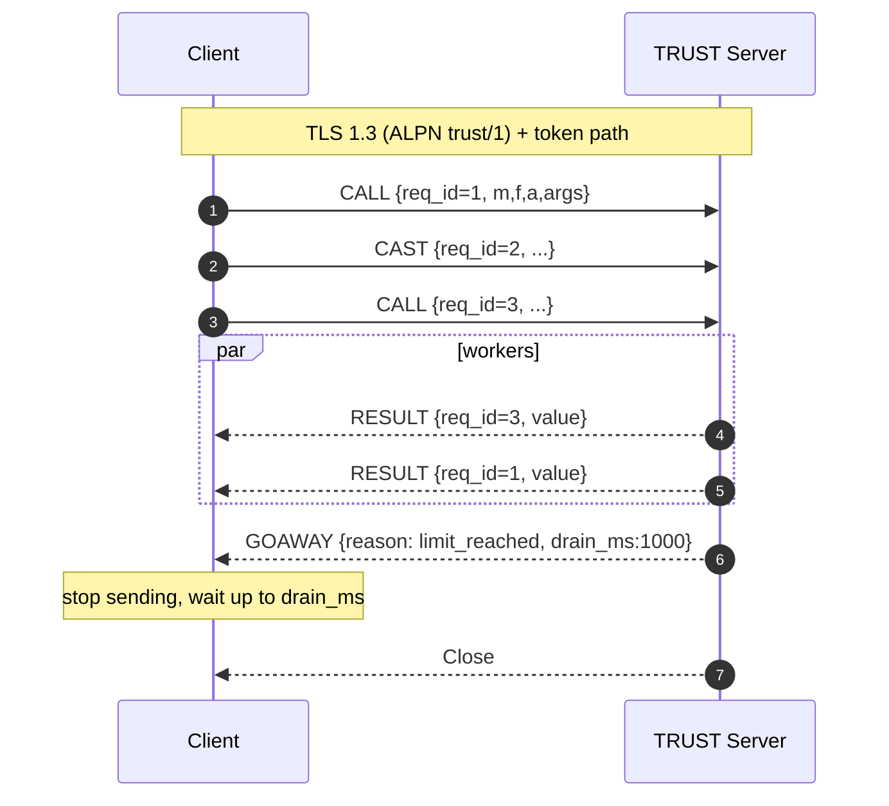
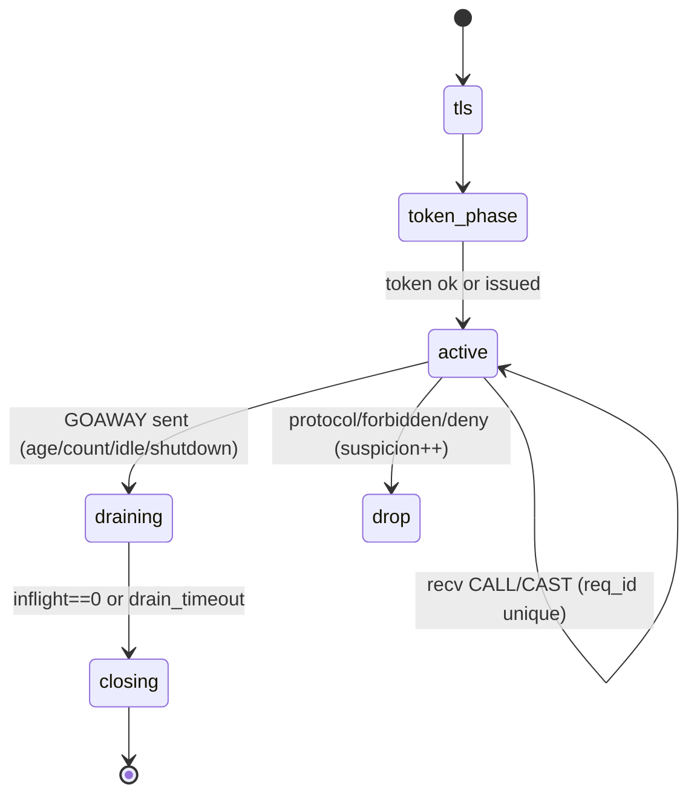
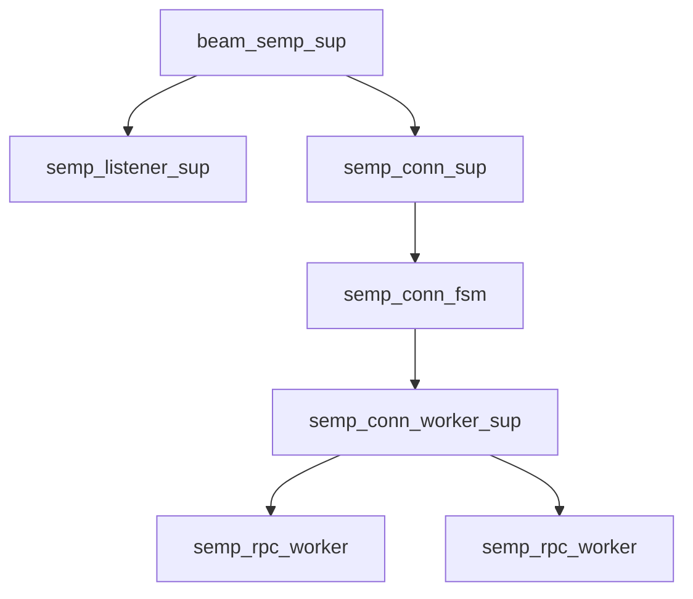

# Overview & Scope

- **Working Title:** *TRUST Windowed Multiplexing*
- **Problem Statement:** Current TRUST overlay permits **one RPC per TLS connection**, creating CPU/RTT overhead. We must add **time- and number-limited multiplexing** while preserving SEMP’s strict security model (mTLS, whitelist, forbidden MFAs, no error leakage).
- **Objectives / Success Metrics:**
  - Reduce median RPC latency under burst by eliminating repeated handshakes
  - Cap per-connection resource use with **session windows** (age + count + inflight)
  - Maintain security invariants and backward compatibility
- **In Scope:** TRUST server & client protocol, connection FSM, policy/limits, metrics.
- **Out of Scope:** TEMPUS overlay changes; long-lived unlimited streams; 0‑RTT; HTTP/2.
- **Primary Users / Personas:** BEAM services using TRUST for RPC (operators & service authors).

# Requirements & Assumptions

**Traceable IDs:** R-1..R-9

- **Functional Requirements:**
  - **R-1:** Support multiple CALL/CASTs per TLS connection within a **session window**.
  - **R-2:** Session window ends on first of: **max\_age\_ms**, **max\_calls**, **idle\_ms**; then server sends **GOAWAY** and closes gracefully.
  - **R-3:** Limit concurrent work with **max\_inflight** per connection (backpressure via TCP + reads paused).
  - **R-4:** Responses are correlated by existing ``; order is not guaranteed.
  - **R-5:** Preserve security: mTLS, whitelist, forbidden MFAs, **no error frames** to client.
  - **R-6:** Backward compatible with one‑RPC behavior (limits set to 1 → identical semantics).
  - **R-7:** Per‑fingerprint suspicion/quarantine logic remains authoritative.
  - **R-8:** Emit metrics: session\_age, calls\_total, inflight\_peak, closes\_by\_reason.
  - **R-9:** Configuration via `beam_semp` application env (`session` map includes `max_inflight`, `max_age_ms`, `idle_ms`, `max_calls`, ``). **Code default = 1000 ms**, overridable via `sys.config`; validated on boot.

| ID  | Requirement                            | Priority | Source | Status |
| --- | -------------------------------------- | -------- | ------ | ------ |
| R-1 | Multiplexed session window             | Must     | Team   | Draft  |
| R-2 | Window end by age/count/idle           | Must     | Team   | Draft  |
| R-3 | Per-conn max\_inflight                 | Must     | Team   | Draft  |
| R-4 | Response correlation by req\_id        | Must     | Team   | Draft  |
| R-5 | Preserve security model                | Must     | Team   | Draft  |
| R-6 | Backward compatibility                 | Must     | Team   | Draft  |
| R-7 | Suspicion/quarantine unchanged         | Must     | Team   | Draft  |
| R-8 | Metrics                                | Should   | Ops    | Draft  |
| R-9 | Config via beam\_semp env & sys.config | Must     | Ops    | Draft  |

# Architecture & Rationale

- **Architectural Style:** Windowed, short‑lived multiplexed sessions over TLS; **per‑connection **``** (handle\_event mode)** managing session limits and backpressure.
- **Key Components:**
  - `semp_listener_sup` → acceptor pool handing off accepted TLS sockets.
  - `semp_conn_sup` (DynamicSupervisor) → starts one `` per accepted socket.
  - `semp_conn_fsm` (gen\_statem states: `handshake_token → active → draining → closing`) → owns socket, window counters/timers, inflight tracking, pauses/resumes reads, emits GOAWAY.
  - `` (per‑connection DynamicSupervisor) → owns **temporary** `semp_rpc_worker` children (≤ `max_inflight`).
- **Data Model (high-level):** ETF frames + control frame `GOAWAY #{reason, drain_ms}`; responses correlated via existing `req_id`.
- **External Integrations:** unchanged (mTLS, whitelist, token issuance/validation).
- **Technology Choices & Rationale:** Per‑connection worker supervisor gives uniform lifecycle, crash isolation, and clean shutdown in `draining/closing` while keeping the FSM minimal. Children are `temporary`; no restarts after completion.
- **Configuration & Defaults:**
  - Defaults in `beam_semp.app.src` under `{env, [...]}` with `session` map.
  - **Default **``** = 8** (can be overridden in `sys.config`).
  - `sys.config` precedence: runtime overrides app file defaults at boot.
- **Risk Areas & Mitigations:**
  - Unbounded concurrency → **cap **``, pause reads when full, resume on worker `DOWN`.
  - Session leak → hard `` and `drain_timeout`; terminate in `closing`.
  - Memory under paused reads → per‑frame size cap & queued‑bytes limit per connection.

# Mermaid Diagrams








# FSM Transition Tables

### Connection FSM (`semp_conn_fsm`, handle\_event mode)

*Assumptions:* ETF frames; per-connection limits `{max_inflight, max_age_ms, idle_ms, max_calls}`; timers use `state_timeout`; workers are temporary children under `semp_conn_worker_sup`.

| State             | Event                                        | Guard/Condition                                           | Actions (effects)                                                                                                                               | Next       | Timer      |
| ----------------- | -------------------------------------------- | --------------------------------------------------------- | ----------------------------------------------------------------------------------------------------------------------------------------------- | ---------- | ---------- |
| `handshake_token` | `info:{ssl, Sock, Bin}` (TOKEN/HELLO)        | TLS ok ∧ whitelist ok ∧ token ok                          | send `OK`; set `{state_timeout, idle_ms, idle}`; start one-shot **max\_age** timer via `erlang:send_after`; `ssl:setopts(Sock,[{active,once}])` | `active`   | idle       |
| `handshake_token` | `info:{ssl,_,_}`                             | token invalid ∨ forbidden MFA                             | send `GOAWAY#{reason:=deny,drain_ms:=0}`; `ssl:close(Sock)`                                                                                     | `closing`  | —          |
| `handshake_token` | `info:{ssl_error/ssl_closed}`                | —                                                         | close socket; log suspicion++                                                                                                                   | `closing`  | —          |
| `active`          | `info:{ssl, Sock, Bin}` (CALL/CAST) → decode | `inflight < max_inflight`                                 | spawn monitored `semp_rpc_worker`; `inflight++`; `calls_total++`; reset idle (`state_timeout=idle_ms`); keep `{active,once}`                    | `active`   | idle       |
| `active`          | `info:{ssl, _, _}` (CALL/CAST)               | `inflight >= max_inflight`                                | **pause reads** `ssl:setopts(Sock,[{active,false}])`; **do not decode or queue**; rely on TCP/TLS backpressure                                  | `active`   | idle       |
| `active`          | `internal:limit_reached`                     | `calls_total>=max_calls ∨ max_age_expired ∨ idle_expired` | send `GOAWAY#{reason:=limit_reached,drain_ms:=Drain}`; set `state_timeout=Drain` (tag `drain`); stop accepting new requests                     | `draining` | drain      |
| `active`          | `info:'DOWN'(Pid,_,process,Pid,Reason)`      | worker finished                                           | `inflight--`; if paused and `inflight < max_inflight` → `ssl:setopts(Sock,[{active,once}])`                                                     | `active`   | reset idle |
| `active`          | `info:{ssl_closed/ssl_error}`                | —                                                         | close socket                                                                                                                                    | `closing`  | —          |
| `draining`        | `info:{ssl, _, _}` (new CALL/CAST)           | —                                                         | ignore/log; (optionally count as refused)                                                                                                       | `draining` | —          |
| `draining`        | `info:'DOWN'` & `inflight==0`                | —                                                         | `ssl:close(Sock)`                                                                                                                               | `closing`  | —          |
| `draining`        | `state_timeout` (drain)                      | —                                                         | `ssl:close(Sock)`                                                                                                                               | `closing`  | —          |
| `closing`         | any                                          | —                                                         | terminate `{stop,normal}`; cancel timers; demonitor residual                                                                                    | —          | —          |

**Notes**

- **Max-age:** set once on entry to `active` (self-message toggles `max_age_expired=true` → raises `internal:limit_reached`).
- **Idle:** every handled event in `active` resets `state_timeout(idle)`.
- **Backpressure:** when `inflight==max_inflight`, keep socket inactive; on `'DOWN'`, resume with `{active,once}`.
- **Metrics:** increment `calls_total`, `closes_by_reason`, `inflight_peak`; tag with client fingerprint.

# Process Tree & Specs

### Supervision Overview

- **Root:** `beam_semp_sup` (one\_for\_one; intensity **5/10s**)
  - `semp_listener_sup` (acceptor pool)
  - `semp_conn_sup` (**DynamicSupervisor**, one\_for\_one; intensity **50/10s**)

### Per-connection

- `semp_conn_sup` starts `` (one per TLS socket). The FSM then starts (and links) a **per-connection **`` (DynamicSupervisor) to own RPC workers. When the FSM transitions to `closing` and exits **normal**, the linked worker supervisor also terminates.

### Child Specs

**Connection FSM (**``**)** — child of `semp_conn_sup`

```erlang
#{ id => semp_conn_fsm,
   start => {semp_conn_fsm, start_link, [Socket, PeerInfo, Opts]},
   restart => temporary,        %% session closes normally; do not restart
   shutdown => 5000,            %% allow clean GOAWAY/drain
   type => worker,
   modules => [semp_conn_fsm] }.
```

**Per-connection Worker Supervisor (**``**)** — started (linked) by FSM

```erlang
%% in semp_conn_worker_sup:init/1
{ok, {#{ strategy => one_for_one,
         intensity => 10,      %% max restarts
         period => 5 },        %% within seconds
       []}}.
```

**RPC Worker (**``**)** — child of `semp_conn_worker_sup`

```erlang
RpcSpec(ReqId, Req, ConnCtx) ->
  #{ id => {semp_rpc_worker, ReqId},
     start => {semp_rpc_worker, start_link, [Req, ConnCtx]},
     restart => temporary,     %% completes or crashes; never restart
     shutdown => 4000,         %% give M/F/A call a moment to finish
     type => worker,
     modules => [semp_rpc_worker] }.
```

### Start/Stop Semantics

- **Start order:** FSM starts, validates token → on `active`, it starts `semp_conn_worker_sup` (if not
